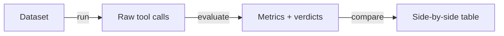

# llm-memory-bench

Benchmark LLM **proactive tool-calling judgment** — the ability to decide *when* to act without being explicitly asked.

Existing tool-calling benchmarks ([BFCL](https://gorilla.cs.berkeley.edu/leaderboard.html), [TaskBench](https://openreview.net/pdf?id=ZUbraGNpAq)) test structural complexity: can the model call the right function with the right arguments? But they test **reactive** tool use — the user asks a question, the model picks a tool. The hard part of real-world tool use is often **proactive judgment**: recognizing that something worth acting on just happened, with no explicit trigger.

Memory extraction is a natural testbed for this. In a conversation, the user never says "save this to memory." They mention they're a data scientist, or that they prefer Python, or that there's a deploy freeze on Thursday. The model must recognize these as worth persisting, decide to call the memory tool unprompted, and do so at the right moment — all while ignoring the ~90% of turns that are noise.

This project uses conversations from [AlpsBench](https://huggingface.co/datasets/Cosineyx/Alpsbench) with human-verified ground-truth annotations, and tests LLMs against tool schemas and prompts inspired by real memory systems.

**Two benchmarks** (what you're measuring):

- **Extraction** — can the LLM identify implicit triggers in noisy conversation and call the memory tool proactively?
- **Value** — do stored memories actually improve downstream task performance?

**Two execution modes** (how you run them):

- **API-level** (`run`, `value-run`) — Direct LLM API calls with simulated memory tools. The benchmark provides the system prompt and tool schemas (from `src/llm_memory_bench/systems/`), intercepts tool calls, and simulates success responses. Fast iteration, works with any LLM provider. Supports both extraction and value benchmarks.

- **Containerised** (`bench`) — Real agent + real memory system integration testing. Runs Claude Code (or other agents) with actual memory systems (gbrain, Claude Code auto-memory) installed via MCP inside Docker. The agent makes real tool calls, data is actually stored, and we query what was saved. Currently implements extraction benchmark; value benchmark support could be added.

**These are orthogonal:** You can run either benchmark (extraction or value) in either mode. Currently, the containerised mode is only implemented for extraction, but could be extended to value benchmarking.

| | Extraction Benchmark | Value Benchmark |
|---|---|---|
| **API-level** | ✅ `run` | ✅ `value-run` |
| **Containerised** | ✅ `bench` | ⚠️ Not yet implemented |

**Key difference:** API-level tests "can the LLM use these tools correctly?" Containerised tests "does the full agent + memory system stack work together?"

### Execution Mode Comparison (Extraction Benchmark)

```
API-Level Mode                          Containerised Mode
─────────────────────────────────────   ─────────────────────────────────────
runner.py                               bench.py
  ↓                                       ↓
MemorySystem adapter                    Docker container
(Python class in src/)                  (real agent + real memory system)
  ↓                                       ↓
.system_prompt() → LLM API              Agent SDK → Claude Code
.tool_definitions() → LLM API             ↓
  ↓                                     Real MCP calls to gbrain
LLM returns tool calls                    ↓
  ↓                                     Actual storage in database
Intercepted & recorded                    ↓
  ↓                                     query.sh dumps stored data
.format_tool_result() simulates           ↓
success response                        Compared to ground truth
  ↓
Compared to ground truth

Uses: src/llm_memory_bench/systems/    Uses: systems/ (top-level)
      gbrain.py (Python class)                gbrain/ (bash scripts)
```

*Note: Value benchmark uses the same execution modes but measures quality/efficiency instead of extraction accuracy.*

See [docs/architecture.md](docs/architecture.md) for diagrams and detailed design.

## Install

```bash
pip install -e .
```

Requires Python 3.11+. The containerised benchmark also requires Docker.

## Terminology

**Memory system** has multiple meanings in this project:

1. **Conceptual:** A product/service that provides memory capabilities (e.g., GBrain MCP server, Claude Code auto-memory, MemoryHub)

2. **API-level adapter:** Python classes in `src/llm_memory_bench/systems/` that bundle:
   - The actual system prompt a memory system uses
   - The actual tool schemas (MCP format)
   - Logic to extract facts from tool calls
   - Used by: API-level execution mode (`run`, `value-run`)

3. **Container scripts:** Bash scripts in top-level `systems/` that:
   - Install the real memory system (`install.sh`)
   - Query what was stored (`query.sh`)
   - Reset state between tests (`cleanup.sh`)
   - Used by: Containerised execution mode (`bench`)

**These are completely separate:** API-level adapters are Python classes for fast testing. Container scripts install and query real systems for integration testing.

```
project root/
├── src/llm_memory_bench/
│   └── systems/              ← API-level (Python classes)
│       ├── base.py
│       ├── gbrain.py         ← GBrainMemorySystem class
│       └── simple.py
│
└── systems/                  ← Containerised (bash scripts)
    ├── gbrain/
    │   ├── install.sh        ← npm install gbrain
    │   └── query.sh          ← gbrain recall --json
    └── claude-code-memory/
```

## Quick start

### API-level benchmark

```bash
# 1. Convert the AlpsBench dataset
llm-memory-bench convert --source alpsbench

# 2. Run the extraction benchmark (captures tool calls)
llm-memory-bench run \
  --dataset datasets/converted/alpsbench-task1.yaml \
  --system claude_code \
  --provider vertex \
  --model claude-sonnet-4@20250514

# 3. Evaluate against ground truth (computes metrics)
llm-memory-bench evaluate results/run_*.json \
  --matcher embedding

# 4. Compare multiple evaluations
llm-memory-bench compare results/eval_*.json
```

### Containerised benchmark

```bash
# Run through real Claude Code + gbrain in Docker
llm-memory-bench bench configs/claude-gbrain.yaml
```

## Memory systems (API-level)

Each API-level memory system bundles a prompt, tool schemas, and extraction logic inspired by real memory systems. Different prompt designs frame the judgment differently — flat facts vs typed categories vs hierarchical pages — letting you test whether prompt design affects proactive tool-calling quality.

These are Python adapter classes in `src/llm_memory_bench/systems/` used by the API-level execution mode.

```bash
llm-memory-bench list-systems
```

| System | Description |
|--------|-------------|
| `bfcl_baseline` | BFCL-style generic prompt with no proactive guidance (reactive baseline for comparison) |
| `simple` | Basic proactive system: `add_memory(fact, category)` with explicit storage guidance |
| `claude_code` | Claude Code's auto-memory: typed memories (user/feedback/project/reference) with structured `save_memory` tool |
| `gbrain` | GBrain MCP knowledge-brain: `put_page` with slug-organized markdown pages + `capture` for quick one-liners |
| `memoryhub` | MemoryHub unified `memory(action=...)` dispatcher with scoped writes, weighted memories, and content type classification |
| `openclaw` | OpenClaw file-backed memory: `write`/`edit` to `USER.md`, `MEMORY.md`, and `memory/YYYY-MM-DD.md` daily notes |

## Benchmarks

### Extraction benchmark

Tests **proactive tool-calling judgment**: can the LLM identify implicit triggers in noisy conversation and call the memory tool unprompted, at the right time, with the right content?



The workflow has three steps:

#### 1. Run (capture tool calls)

```bash
llm-memory-bench run \
  --dataset datasets/converted/alpsbench-task1.yaml \
  --system <simple|claude_code|gbrain> \
  --provider <anthropic|vertex|openai|litellm> \
  --model <model-id> \
  --output results/run.json
```

Feeds conversations through the LLM and captures raw tool calls. Does not compute metrics.

**Options:**

| Flag | Default | Description |
|------|---------|-------------|
| `--dataset` | *(required)* | Path to converted dataset YAML |
| `--system` | `simple` | Memory system to benchmark |
| `--provider` | `anthropic` | LLM provider |
| `--model` | `claude-sonnet-4-20250514` | Model to test |
| `--max-conversations` | all | Limit conversations for quick tests |
| `--max-total-tokens` | none | Stop after this many reported input plus output tokens |
| `--max-cost-usd` | none | Stop after this estimated USD spend |
| `--dry-run-estimate` | false | Show estimated usage without calling the provider |
| `--output` | auto-generated | Output path for run data |
| `--api-key-env` | auto | Env var name for the API key |

Budget controls are cumulative across all API calls. The estimate is approximate; the run output records actual provider-reported token usage. If both limits are supplied, the run stops when either limit is reached. Cost limits require pricing data for the selected model.

#### 2. Evaluate (compute metrics)

```bash
llm-memory-bench evaluate results/run_*.json \
  --matcher <embedding|llm|hybrid> \
  --dataset datasets/converted/alpsbench-task1.yaml
```

Compares captured tool calls against ground truth using semantic matching. Computes precision, recall, F1, noise resistance, and schema validity.

**Options:**

| Flag | Default | Description |
|------|---------|-------------|
| `RUN_FILE` | *(required)* | Path to run output from step 1 |
| `--dataset` | from run file | Path to dataset (optional if run file has embedded ground truth) |
| `--matcher` | `embedding` | Fact matching strategy: `embedding` (fast, local), `llm` (semantic, requires judge), or `hybrid` (two-stage) |
| `--judge-provider` | from run | Provider for LLM/hybrid matcher |
| `--judge-model` | from run | Model for LLM/hybrid matcher |
| `--output` | auto-generated | Output path for evaluation results |
| `--api-key-env` | auto | Env var name for the API key |

**Matchers:**

- **`embedding`** (default) — Fast, local, no API costs. Uses sentence embeddings to match facts. May miss paraphrases.
- **`llm`** — Semantic understanding via LLM judge. Requires `--judge-provider` and `--judge-model`. Slow but accurate.
- **`hybrid`** — Two-stage: embedding filter + LLM for uncertain cases. Requires judge config. 75-80% cost reduction vs pure LLM. See [docs/hybrid-matcher.md](docs/hybrid-matcher.md).

#### 3. Compare (view results)

```bash
llm-memory-bench compare results/eval_*.json
```

Prints side-by-side metrics across multiple evaluations.

**Metrics:**

- **extraction_precision** — of all tool calls made, how many matched expected facts
- **extraction_recall** — of all expected facts, how many were captured by tool calls
- **extraction_f1** — harmonic mean of precision and recall
- **noise_resistance_rate** — fraction of noise turns where no tool was called
- **schema_validity_rate** — fraction of tool calls with valid arguments per the schema

See [docs/metrics.md](docs/metrics.md) for detailed definitions, formulas, interpretation guide, and comparison to BFCL metrics.

### Value benchmark

Tests whether stored memories actually improve task performance. Generates scenarios from conversations, then runs paired trials — one with memory and one without — to measure the delta.

```bash
# Generate scenarios (one-time, uses an LLM)
llm-memory-bench value-generate \
  --source alpsbench \
  --output scenarios \
  --max-scenarios 50

# Run paired trials
llm-memory-bench value-run \
  --scenarios scenarios \
  --system gbrain \
  --mode prompt \
  --max-turns 10 \
  --output results/value-run.json
```

**Options for `value-run`:**

| Flag | Default | Description |
|------|---------|-------------|
| `--scenarios` | *(required)* | Path to generated scenarios |
| `--system` | `simple` | Memory system to use |
| `--mode` | `prompt` | How memories are injected: `prompt` (in system prompt), `tool` (via recall tool), or `both` |
| `--max-turns` | `10` | Max conversation turns per trial |
| `--user-sim-provider` | same as `--provider` | Provider for the simulated user |
| `--user-sim-model` | same as `--model` | Model for the simulated user |
| `--max-scenarios` | all | Limit scenarios for quick tests |

## Baseline comparison

To isolate **proactive judgment** from general tool-calling ability, compare against [BFCL](https://gorilla.cs.berkeley.edu/leaderboard.html) (Berkeley Function Calling Leaderboard):

```bash
# Install BFCL
pip install bfcl

# Run baseline (explicit function requests)
bfcl generate --model claude-sonnet-4-20250514 --test-category live_simple
bfcl evaluate --model claude-sonnet-4-20250514 --test-category live_simple

# Run memory benchmark (proactive judgment)
llm-memory-bench run --dataset datasets/converted/alpsbench-task1.yaml \
  --system memoryhub --model claude-sonnet-4-20250514

llm-memory-bench evaluate results/run_*.json --matcher embedding

# Compare scores
cat ~/.cache/bfcl/result/claude-sonnet-4-20250514/live_simple_score.json
cat results/eval_*.json
```

**The gap** between BFCL accuracy and AlpsBench recall represents the cost of proactive judgment. If BFCL scores are high but memory extraction is low, the model can execute tools correctly when told to, but struggles to identify what's worth storing in natural conversation.

See [docs/baseline-comparison.md](docs/baseline-comparison.md) for detailed analysis.

## Prompt design comparison

The `bfcl_baseline` system uses generic prompts (like BFCL does) to establish a floor, then compare against memory-optimized systems:

```bash
# Step 1: Run each system with the same model
for sys in bfcl_baseline simple memoryhub; do
  llm-memory-bench run --dataset datasets/converted/alpsbench-task1.yaml \
    --system $sys --model claude-sonnet-4@20250514
done

# Step 2: Evaluate all runs
for run in results/run_*.json; do
  llm-memory-bench evaluate "$run" --matcher embedding
done

# Step 3: Compare
llm-memory-bench compare results/eval_*.json
```

**Expected pattern:**
- `bfcl_baseline`: ~28% recall (generic "use tools when needed" prompt)
- `simple`: ~65% recall (+37% with basic proactive guidance)
- `memoryhub`: ~72% recall (+7% with comprehensive prompting)

This isolates the **value of proactive prompt design** separate from model capability.

See [docs/prompt-comparison.md](docs/prompt-comparison.md) for detailed workflow and interpretation.

### Containerised mode

Runs benchmarks through the full stack: a real coding agent (Claude Code) with a real memory system (gbrain, Claude Code auto-memory) installed inside Docker. Instead of intercepting tool calls at the API layer, the agent uses the memory system for real and we query what was stored afterward.

**Currently supports:** Extraction benchmark only (value benchmark in containers not yet implemented)

```bash
llm-memory-bench bench configs/claude-gbrain.yaml
```

This builds a Docker image with the host agent pinned to a specific version, installs the memory system via bash scripts from top-level `systems/` directory, feeds conversations through the agent, then queries what was actually stored.

**Note:** Containerised mode does NOT use the Python `MemorySystem` adapters. It installs and queries real memory systems via bash scripts. This is true regardless of which benchmark (extraction or value) runs in the container.

**Config format** (`configs/claude-gbrain.yaml`):

```yaml
host:
  name: claude-code
  version: "1.0.33"

system:
  name: gbrain
  version: "0.46.19.0"
  env:
    GBRAIN_SURFACE: starter

model: claude-sonnet-4@20250514

dataset: datasets/converted/task1.jsonl

max_conversations: 10
```

**Project layout for containerised benchmarks:**

```
hosts/
  claude-code/
    Dockerfile        # Base image: node + Claude Code CLI + Agent SDK
    entrypoint.sh     # Runs system installer on container start
    driver.py         # Feeds conversations via Claude Agent SDK

systems/
  gbrain/
    install.sh        # npm install + claude mcp add
    cleanup.sh        # Reset stored data between conversations
    query.sh          # Dump what was stored as JSON
  claude-code-memory/
    install.sh        # Configure auto-memory
    cleanup.sh
    query.sh

configs/
  claude-gbrain.yaml
  claude-memory.yaml
```

## Comparing results

```bash
llm-memory-bench compare results/eval_*.json
```

Prints a side-by-side table of all metrics across evaluations, labeled by provider/model/system. Can also compare run files directly (without evaluation), but metrics will be limited.

## Dataset

Uses [AlpsBench](https://huggingface.co/datasets/Cosineyx/Alpsbench) — conversations with human-verified memory items linked to source utterances.

- **Task 1 (Extraction):** Given a conversation, identify which facts to store
- **Task 2 (Updating):** Given a conversation and existing memories, identify new or updated facts

```bash
# Full dataset (English only by default)
llm-memory-bench convert --source alpsbench

# Small subset for testing
llm-memory-bench convert --source alpsbench --max-conversations 10

# Include all languages
llm-memory-bench convert --source alpsbench --all-languages
```

## Providers

| Provider | `--provider` value | Auth | Notes |
|----------|-------------------|------|-------|
| Anthropic | `anthropic` | `ANTHROPIC_API_KEY` | Claude models via direct API |
| Vertex AI | `vertex` | `ANTHROPIC_VERTEX_PROJECT_ID`, `GOOGLE_CLOUD_REGION` | Claude models via Vertex AI |
| OpenAI | `openai` | `OPENAI_API_KEY` | GPT models |
| LiteLLM | `litellm` | varies | Gemini, Mistral, Ollama, Bedrock, etc. |

## Adding a memory system

### Adding an API-level adapter

Create a new file in `src/llm_memory_bench/systems/` implementing the `MemorySystem` base class:

```python
from llm_memory_bench.systems.base import MemorySystem
from llm_memory_bench.providers.base import ToolCall

class MyMemorySystem(MemorySystem):
    name = "my_system"
    description = "Description shown in list-systems"

    def system_prompt(self) -> str:
        """Return the actual system prompt your memory system uses."""
        return "..."

    def tool_definitions(self) -> list[dict]:
        """Return the actual tool schemas your system exposes."""
        return [{"name": "...", "description": "...", "input_schema": {...}}]

    def extract_stored_fact(self, tool_call: ToolCall) -> str:
        """Extract the semantic content from a tool call for evaluation."""
        return tool_call.arguments.get("content", "")

    def format_tool_result(self, tool_call: ToolCall) -> dict:
        """Return what your system would respond with."""
        return {"status": "ok"}
```

Then register it in `src/llm_memory_bench/systems/__init__.py`.

### Adding a containerised system

Create a directory in top-level `systems/` with three bash scripts:

```bash
systems/my_system/
├── install.sh    # Install and configure the real memory system
├── query.sh      # Output stored data as JSON to stdout
└── cleanup.sh    # Reset state between conversations
```

**install.sh** example:
```bash
#!/usr/bin/env bash
set -euo pipefail

npm install -g my-memory-system
claude mcp add my-system -- my-system serve
```

**query.sh** example:
```bash
#!/usr/bin/env bash
set -euo pipefail

# Query the real system and output JSON
my-system dump --format json
```

**cleanup.sh** example:
```bash
#!/usr/bin/env bash
set -euo pipefail

my-system reset
```

Then create a config file in `configs/`:

```yaml
host:
  name: claude-code
  version: "1.0.33"

system:
  name: my_system    # Must match directory name in systems/

model: claude-sonnet-4@20250514
dataset: datasets/converted/alpsbench-task1.yaml
```

## Example: comparing systems across models

```bash
# Step 1: Run benchmark for each system/model combination
for sys in simple claude_code gbrain; do
  llm-memory-bench run \
    --dataset datasets/converted/alpsbench-task1.yaml \
    --system $sys \
    --provider vertex \
    --model claude-sonnet-4@20250514
done

for sys in simple claude_code gbrain; do
  llm-memory-bench run \
    --dataset datasets/converted/alpsbench-task1.yaml \
    --system $sys \
    --provider openai \
    --model gpt-4o
done

# Step 2: Evaluate all runs
for run in results/run_*.json; do
  llm-memory-bench evaluate "$run" --matcher embedding
done

# Step 3: Compare all evaluations
llm-memory-bench compare results/eval_*.json
```
